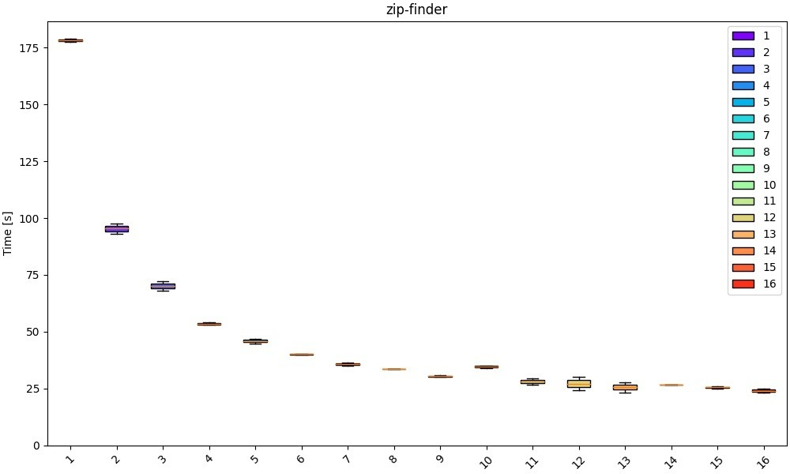

# zip-password-finder
[](https://github.com/agourlay/zip-password-finder/actions/workflows/ci.yml)
[](https://crates.io/crates/zip-password-finder)

`zip-password-finder` is a tool to find the password of protected zip files.

The design of this tool is described in details in the following blog articles:
- [Brute forcing protected ZIP archives in Rust](https://agourlay.github.io/brute-forcing-protected-zip-rust/)
- [Follow up on cracking ZIP archives in Rust](https://agourlay.github.io/follow-up-cracking-zip-rust/)

## Features

- Supports both ZipCrypto and AES encryption.
- Leverages multiple threads to speed up the process
- Dictionary attack to test passwords from a dictionary text file (one word per line)
- Brute force to generate all passwords for a given charset and a password length range

The available charsets for the password generation are:

```
  l | abcdefghijklmnopqrstuvwxyz [a-z]
  u | ABCDEFGHIJKLMNOPQRSTUVWXYZ [A-Z]
  d | 0123456789                 [0-9]
  h | 0123456789abcdef           [0-9a-f]
  H | 0123456789ABCDEF           [0-9A-F]
  s | «space»!"#$%&'()*+,-./:;<=>?@[\]^_`{|}~
```

Alternatively, you can provide a custom charset file with the `--charsetFile` option.

It accepts a file path for a `txt` file containing a single line of characters to use for the password generation.

## Installation

### Releases

Using the provided binaries in https://github.com/agourlay/zip-password-finder/releases

### Crates.io

Using Cargo via [crates.io](https://crates.io/crates/zip-password-finder).

```bash
cargo install zip-password-finder
```

### AUR

You can install [`zip-password-finder`](https://aur.archlinux.org/packages?O=0&K=zip-password-finder) from the AUR using an [AUR helper](https://wiki.archlinux.org/title/AUR_helpers). For example:

```bash
paru -S zip-password-finder
```

## Usage

```bash
./zip-password-finder -h
Find the password of protected ZIP files

Usage: zip-password-finder [OPTIONS] --inputFile <inputFile>

Options:
  -i, --inputFile <inputFile>                    path to zip input file
  -w, --workers <workers>                        number of workers
  -p, --passwordDictionary <passwordDictionary>  path to a password dictionary file
  -c, --charset <charset>                        charset to use to generate password [default: lud]
      --charsetFile <charsetFile>                path to a charset file
      --minPasswordLen <minPasswordLen>          minimum password length [default: 1]
      --maxPasswordLen <maxPasswordLen>          maximum password length [default: 10]
      --fileNumber <fileNumber>                  file number in the zip archive [default: 0]
  -h, --help                                     Print help
  -V, --version                                  Print version
```

## Performance

For AES make sure to use a CPU with `SHA` instructions (Intel Sandy Bridge or newer, AMD Bulldozer or newer) to get the best performance.

Native builds tend to perform better in general.

```RUSTFLAGS="-C target-cpu=native" cargo build --release```

In general this tool seems to suffer from contention as the number of workers increases which makes it impractical for non-trivial passwords.

It makes sense to use a number of workers equal to the number of physical cores.

E.g. of scalability with an 8 core CPU with 16 threads as the number of workers increases:


