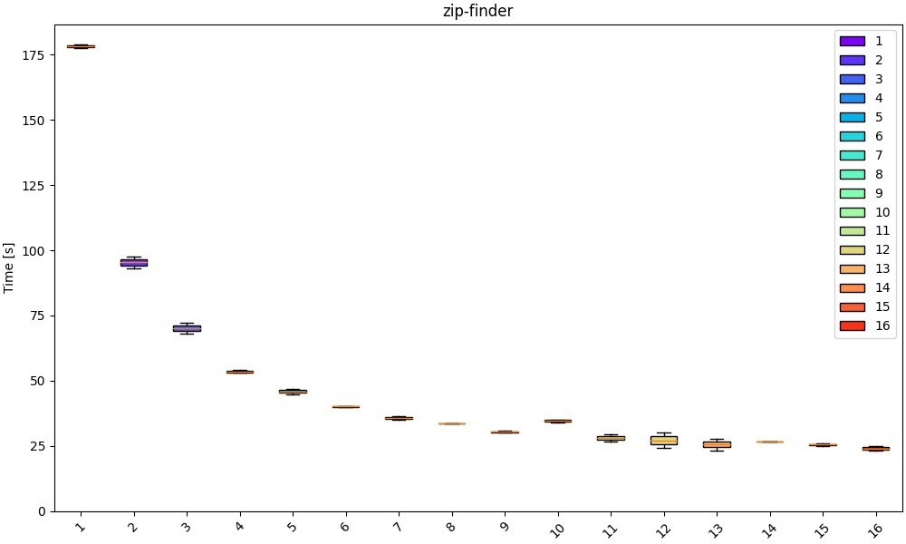

# zip-password-finder
[](https://github.com/agourlay/zip-password-finder/actions/workflows/ci.yml)
[](https://crates.io/crates/zip-password-finder)

`zip-password-finder` is a tool to find the password of protected zip files.

The design of this tool is described in details in the following blog articles:
- [Brute forcing protected ZIP archives in Rust](https://agourlay.github.io/brute-forcing-protected-zip-rust/)
- [Follow up on cracking ZIP archives in Rust](https://agourlay.github.io/follow-up-cracking-zip-rust/)

If this tool helped you recover an archive, consider [sponsoring the project on GitHub](https://github.com/sponsors/agourlay).

## Features

- Supports both ZipCrypto and AES encryption
- Multi-threaded, using all physical CPU cores by default
- Optional GPU acceleration via `--gpu` for AES archives (see [GPU acceleration](#gpu-acceleration))
- Three attack modes: brute force, dictionary, and mask attack
- Graceful interruption with Ctrl-C, displaying the last password tested
- Resume brute force from a specific password with `--startingPassword`
- Automatic detection of encrypted files within multi-file archives
- Progress bar with throughput and ETA

## Attack modes

### Brute force (default)

Generates all passwords for a given charset and password length range. This is the default mode when no dictionary or mask is provided.

```bash
zip-password-finder -i archive.zip -c lud --minPasswordLen 1 --maxPasswordLen 6
```

The available charset presets are:

```
  l | abcdefghijklmnopqrstuvwxyz [a-z]
  u | ABCDEFGHIJKLMNOPQRSTUVWXYZ [A-Z]
  d | 0123456789                 [0-9]
  h | 0123456789abcdef           [0-9a-f]
  H | 0123456789ABCDEF           [0-9A-F]
  s | «space»!"#$%&'()*+,-./:;<=>?@[\]^_`{|}~
```

Presets can be combined, e.g. `lud` (the default) uses lowercase + uppercase + digits.

Alternatively, a custom charset file can be provided with `--charsetFile`. It should be a text file containing a single line of characters to use for the generation.

To resume an interrupted brute force search, use `--startingPassword` to skip ahead:

```bash
zip-password-finder -i archive.zip --startingPassword "abc"
```

### Dictionary

Tests passwords from a text file, one word per line.

```bash
zip-password-finder -i archive.zip -p wordlist.txt
```

### Mask attack

Generates passwords matching a pattern where each position has its own charset. This is useful when you know part of the password structure (e.g. starts with uppercase, ends with digits).

```bash
zip-password-finder -i archive.zip --mask '?u?l?l?l?d?d'
```

The available mask tokens are:

```
  ?l | lowercase letters [a-z]
  ?u | uppercase letters [A-Z]
  ?d | digits [0-9]
  ?s | symbols
  ?a | all printable (lowercase + uppercase + digits + symbols)
  ?h | lowercase hex [0-9a-f]
  ?H | uppercase hex [0-9A-F]
  ?1 | custom charset 1 (--customCharset1)
  ?2 | custom charset 2 (--customCharset2)
  ?3 | custom charset 3 (--customCharset3)
  ?4 | custom charset 4 (--customCharset4)
  ?? | literal '?'
```

Any other character in the mask is treated as a literal.

Custom charsets are defined with `--customCharset1` through `--customCharset4` and can contain literal characters and/or built-in tokens. For example, `--customCharset1 "aeiou"` defines vowels, and `--customCharset1 "?l?d"` defines lowercase letters + digits.

Examples:

```bash
# 3 lowercase letters followed by 2 digits
zip-password-finder -i archive.zip --mask '?l?l?l?d?d'

# known prefix "pass" followed by 4 digits
zip-password-finder -i archive.zip --mask 'pass?d?d?d?d'

# uppercase, 4 lowercase, then a symbol
zip-password-finder -i archive.zip --mask '?u?l?l?l?l?s'

# custom charset: 2 vowels followed by a digit
zip-password-finder -i archive.zip -1 "aeiou" --mask '?1?1?d'
```

## GPU acceleration

For **AES-encrypted** archives, the `--gpu` flag offloads PBKDF2-HMAC-SHA1 derivation to the GPU. Works on any modern desktop GPU via the platform's native graphics API (Vulkan on Linux, Metal on macOS, DX12 on Windows). No extra system dependencies — the binary ships with the GPU backend included.

```bash
zip-password-finder -i archive.zip -c lud --maxPasswordLen 6 --gpu
```

What it does:
- Picks the highest-performance adapter at startup, prints which one it found.
- Batches candidates (16 384 per dispatch) and runs PBKDF2-HMAC-SHA1 in a compute shader.
- Falls back automatically to the CPU path when the remaining search space is below ~16 k candidates (GPU dispatch latency would dominate).
- Errors out cleanly if `--gpu` is requested against a ZipCrypto archive.

Constraints:
- AES only. ZipCrypto is not supported on the GPU path.
- Passwords up to 64 bytes (HMAC long-key path is not implemented). WinZip-AES passwords are well under this in practice.

To probe whether your machine has a usable GPU before running a real search:

```bash
zip-password-finder --gpu-smoke-test
```

This lists detected adapters and runs a trivial compute kernel to confirm the device is functional.

Expected speedup depends heavily on your hardware. On a Radeon 890M iGPU (RDNA 3.5, 16 CUs) the GPU path runs roughly **2–7× faster than 12 CPU cores** for AES-128/256 brute force — the larger the search space, the bigger the win. Discrete GPUs should do considerably better. The `pbkdf2_gpu` benchmark prints throughput in passwords-per-second across batch sizes:

```bash
cargo bench --bench pbkdf2_gpu
```

### Troubleshooting

If `--gpu` exits with `GPU error - no compatible GPU adapter found`, the binary couldn't reach a working Vulkan/Metal/DX12 driver. Common causes:

- **Headless / SSH session without a graphics stack**: the loader has no devices to enumerate. Either run on a desktop session, or install a software adapter (e.g. `mesa-vulkan-drivers` on Debian/Ubuntu, which provides Mesa's `lavapipe`).
- **WSL without GPU passthrough**: WSL2 supports CUDA but Vulkan support is patchy. Use the CPU path or set up GPU passthrough.
- **Stripped Docker container**: install your distribution's Vulkan or Mesa packages in the image.

To diagnose, run the smoke test:

```bash
zip-password-finder --gpu-smoke-test
```

It lists detected adapters and runs a trivial compute kernel. Zero adapters listed means the GPU backend isn't reachable from this binary.

If `--gpu` errors with `--gpu requires an AES-encrypted archive`, the archive uses ZipCrypto (legacy ZIP encryption). The GPU path is AES-only — drop the flag and the CPU path will handle it.

## Installation

### Releases

Using the provided binaries in https://github.com/agourlay/zip-password-finder/releases

### Crates.io

Using Cargo via [crates.io](https://crates.io/crates/zip-password-finder).

```bash
cargo install zip-password-finder
```

### AUR

You can install [`zip-password-finder`](https://aur.archlinux.org/packages?O=0&K=zip-password-finder) from the AUR using an [AUR helper](https://wiki.archlinux.org/title/AUR_helpers). For example:

```bash
paru -S zip-password-finder
```

## Usage

```bash
./zip-password-finder -h
Find the password of protected ZIP files

Usage: zip-password-finder [OPTIONS] --inputFile <inputFile>

Options:
  -i, --inputFile <inputFile>                    path to zip input file
  -w, --workers <workers>                        number of workers
  -p, --passwordDictionary <passwordDictionary>  path to a password dictionary file
  -c, --charset <charset>                        charset to use to generate password [default: lud]
      --charsetFile <charsetFile>                path to a charset file
      --minPasswordLen <minPasswordLen>          minimum password length [default: 1]
      --maxPasswordLen <maxPasswordLen>          maximum password length [default: 10]
      --fileNumber <fileNumber>                  file number in the zip archive [default: 0]
  -s, --startingPassword <startingPassword>      password to start from
  -m, --mask <mask>                              mask pattern for mask attack (e.g. '?l?l?l?d?d')
  -1, --customCharset1 <customCharset1>          custom charset 1 for mask attack, referenced as ?1
  -2, --customCharset2 <customCharset2>          custom charset 2 for mask attack, referenced as ?2
  -3, --customCharset3 <customCharset3>          custom charset 3 for mask attack, referenced as ?3
  -4, --customCharset4 <customCharset4>          custom charset 4 for mask attack, referenced as ?4
  -g, --gpu                                      use the GPU (Vulkan/Metal/DX12 via wgpu) — requires AES-encrypted archive
      --gpu-smoke-test                           list GPU adapters and run a trivial compute kernel, then exit (does not require --inputFile)
  -h, --help                                     Print help
  -V, --version                                  Print version
```

## Performance

For AES make sure to use a CPU with `SHA` instructions (Intel Sandy Bridge or newer, AMD Bulldozer or newer) to get the best performance.

Native builds tend to perform better in general.

```bash
RUSTFLAGS="-C target-cpu=native" cargo build --release
```

The number of workers defaults to the number of physical CPU cores. You can override this with `--workers`, but using more workers than physical cores typically does not help due to contention.

E.g. of scalability with an 8 core CPU with 16 threads as the number of workers increases:


